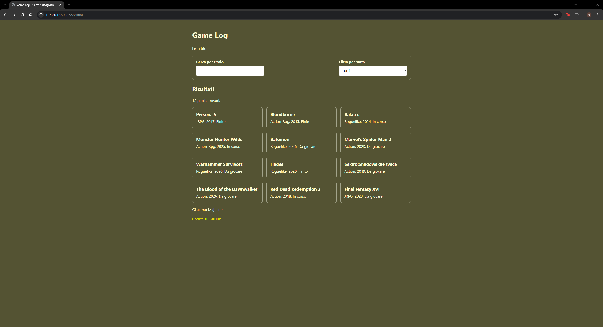
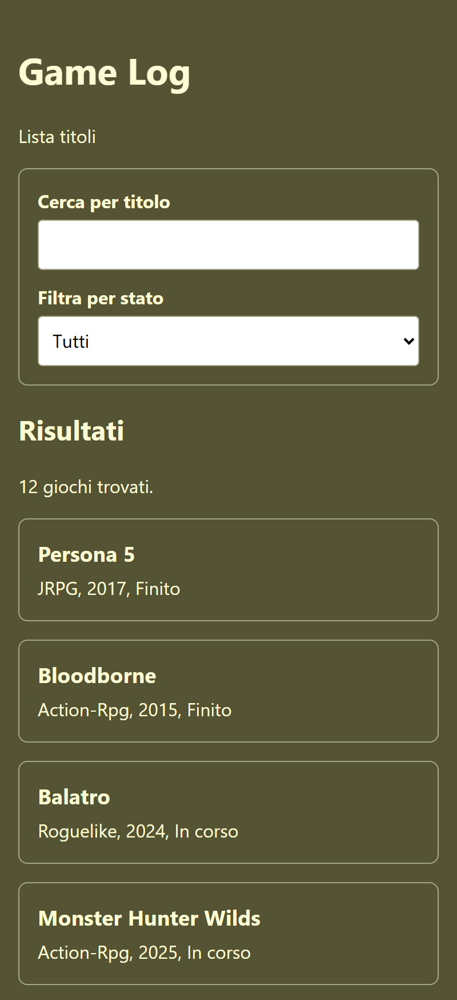

# Game Log

Web app per tenere traccia dei videogiochi giocati, in corso o da giocare, con ricerca per titolo e filtro per stato.

**[Vedi il sito](https://giamajo.github.io/game-log/)**

## Funzionalità

- Elenco di giochi caricato da un file JSON, con titolo, genere, anno e stato
- Ricerca per titolo mentre si scrive, senza distinzione tra maiuscole e minuscole
- Filtro per stato: da giocare, in corso, finito
- Ricerca e filtro combinabili, con il numero di risultati sempre aggiornato
- Layout responsive: una colonna sul telefono, due sul tablet, tre sul computer

## Tecnologie

- HTML5 semantico
- CSS3: variabili, Flexbox, Grid, media query con approccio mobile first
- JavaScript senza framework: `fetch`, `async`/`await`, manipolazione del DOM, eventi
- Dati in JSON
- Pubblicazione con GitHub Pages

## Accessibilità

Il progetto segue i criteri WCAG 2.1 livello AA.

- Struttura semantica con `header`, `main`, `footer` e una zona di ricerca dichiarata
- Ogni campo ha un'etichetta collegata
- Il numero di risultati viene annunciato dai lettori di schermo a ogni ricerca (`aria-live`)
- Contrasto tra testo e sfondo di almeno 4.5:1
- Focus ben visibile e pagina utilizzabile interamente da tastiera
- Campi alti almeno 44 px, comodi da toccare
- Testata con la tastiera e con l'Assistente vocale di Windows
- Lighthouse: 100 in accessibilità, best practices e SEO, su mobile e desktop

## Avviarlo in locale

1. Clonare il repository o scaricarlo come ZIP
2. Aprire la cartella in Visual Studio Code
3. Avviare la pagina con l'estensione Live Server

Serve un server locale perché il browser blocca il caricamento del file JSON con `fetch` quando la pagina viene aperta direttamente dal disco.

## Struttura

- `index.html`: struttura della pagina
- `style.css`: stile e layout responsive
- `script.js`: caricamento dei dati, ricerca e filtro
- `games.json`: i dati dei giochi

## Prossimi passi

- Filtro per genere
- Ordinamento per anno o per titolo
- Versione mobile in React Native sugli stessi dati

## Autore

Giacomo Majolino — [LinkedIn](https://www.linkedin.com/in/giacomo-majolino-635497263)